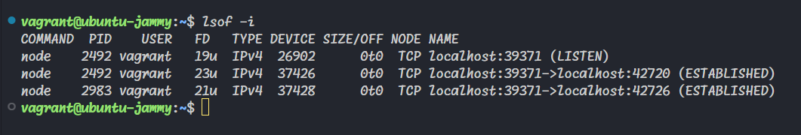

# du

The `du` command, which stands for "disk usage," is a Linux command used to estimate the space occupied by files and directories on a file system.
It provides information about the size of files and directories, helping one understand how much disk space they consume.
Also, when a directory is included in the set of files, the `du` command can operate recursively.
This means it will not only calculate the size of the specified directory itself but also traverse through its subdirectories,
calculating the total disk usage for the entire directory tree.

## du Usage

`du [options] [files or directories]`

- `du -h` or `du --human-readable`: Displays sizes in a human-readable format (e.g., KB, MB, GB).

- `du -s` or `du --summarize`: Displays only the total size of the specified files or directories.

# find

The `find` command in Linux/Unix is a powerful tool used for searching and locating files and directories within a file system.
It is designed to locate files based on various criteria such as file name, size, modification time, permissions, and more.

## find Usage

`find [starting_directory] [options] [expression]`

- `find /path/to/start -name filename.txt`: Locates files by name

- `find /path/to/start -type d`: Lists all directories on the specified path. It also does this recursively.

- `find /path/to/start -mtime -2`: Lists all files and directories in the specified path that has been modified in the past 2 days.

- `find /path/to/start -name "*.log" -exec rm {} \;`: Executes the rm command on any file ending with a `.log` found in the specified path.

# grep

The `grep` command in Linux/Unix is a powerful and flexible tool used for searching and matching patterns within text. Its name stands for "Global Regular Expression Print".

## grep Usage

`grep [options] pattern [files]`

- `grep "pattern" filename`: Searches for lines containing the provided pattern in the file.

- `grep -n "pattern" filename`: Searches for lines containing the provided pattern in the file and displays line numbers along with the matching lines.

- `grep -v "pattern" filename`: Searches for lines not containing the provided pattern in the file.

- `grep -c "pattern" filename`: Give the count of the lines containing the provided pattern in the file.

# chmod

The `chmod` command in Linux/Unix is used to change the permissions of files and directories. Its name stands for "change mode," and it allows you to control who can read, write, and execute a file.

## chmod Usage

`chmod [options] permissions file(s)`

- `chmod 774 dir`: Change permissions using octal notation.

- `chmod u=rx,go=w filename`: Change permissions using permission symbols.

# chown

The `chown` command in Linux/Unix is used to change the ownership of files and directories. Its name stands for "change owner," and it allows you to modify the user and/or group associated with a file or directory.

## chown Usage

`chown [options] new_owner[:new_group] file(s)`

- `chown newuser filename`: Change the owner of a file.

- `chown :newgroup filename.txt`: Change the group of a file without modifying the owner.

# lsof

The `lsof` command in Linux/Unix stands for "List Open Files." It is a powerful and versatile tool used to display information about files and processes that are currently opened by the system.

## lsof Usage

`lsof [options] [files or processes]`

- `lsof -i`: List open Internet sockets (network connections).

# ping

The `ping` command is a network utility used to test the reachability of a host (usually a computer or server) on an Internet Protocol (IP) network. It also measures the round-trip time for messages sent from the originating host to the destination and back.

## ping Usage

`ping [options] host`

- `ping example.com`: Ping a host.

- `ping -c 3 example.com`: Ping a host three times.

# sed

The `sed`command, short for "stream editor," is a powerful text processing tool in Unix-like operating systems. It is designed to perform text transformations on an input stream (a file or data from a pipeline) and produce an output stream.

## sed Usage

`sed [options] 'command' file`

- `sed 's/apple/orange/' filename`: Replace the word "apple" with "orange" in a file

# sort

The `sort` command in Unix/Linux is used to arrange the lines of a text file or the output of a command in a specific order. By default, it sorts lines in ascending order, but it can be customized to sort in descending order or based on certain fields within the lines.

## sort Usage

`sort [options] [file]`

- `sort filename`: Sorts lines in a file in ascending order.

- `sort -rn filename`: Sorts lines numerically in descending order.

- `sort -k2,2 filename`: Sorts lines based on the second field (using space as a delimiter).

# systemctl

The `systemctl` command is a powerful utility in Linux systems used for managing and controlling the systemd service manager. It allows users to start, stop, enable, disable, and manage system services, as well as examine their status and view their logs.

## systemctl Usage

`systemctl [options] [command] [unit]`

- `systemctl status servicename`: Displays the current status of a service.

- `systemctl stop servicename`: Stop a service.

- `systemctl start servicename`: Start a service.
